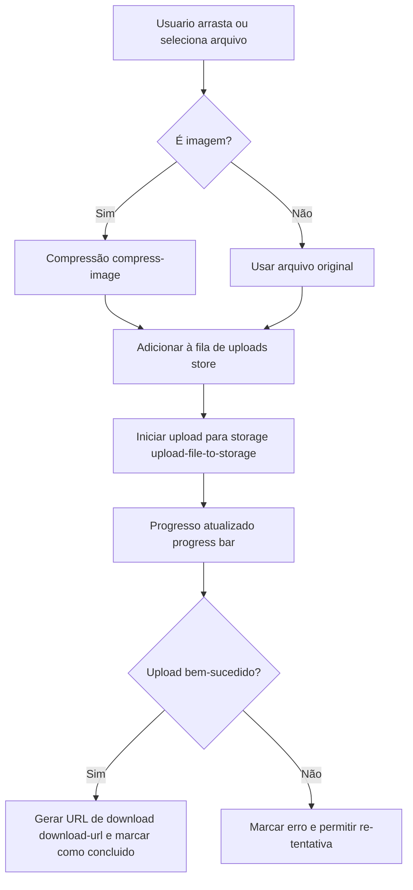
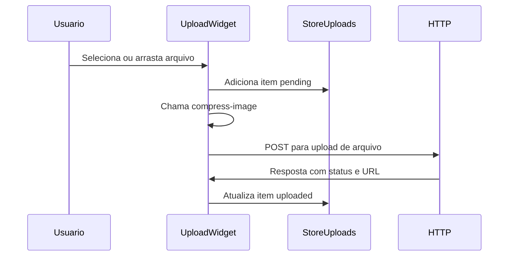

# Upload Widget Web

Aplicação de widget de upload de arquivos (versão inicial) — um componente leve para arrastar e soltar, gerenciar uploads, compactar imagens e enviar para um endpoint de storage.

## Visão Geral

O projeto fornece um widget de upload pronto para ser embutido em aplicações web modernas. Permite seleção via arrastar e soltar, visualização da lista de uploads, indicadores de progresso, minimizar o widget e compressão automática de imagens antes do envio.

## Funcionalidades
- Suporte a arrastar e soltar (drag & drop)
- Seleção de arquivos via diálogo do sistema
- Compressão de imagens antes do upload (ver `src/utils/compress-image.ts`)
- Lista de uploads com status, progresso e ações (ver `src/components/upload-widget-upload-list.tsx` e `src/components/upload-widget-upload-item.tsx`)
- Barra de progresso circular customizada (ver `src/components/ui/circular-progress-bar.tsx`)
- Botão para minimizar/restaurar o widget (ver `src/components/upload-widget-minimized-button.tsx`)
- Cabeçalho do widget com título e ações (ver `src/components/upload-widget-header.tsx` e `src/components/upload-widget-title.tsx`)
- Upload para storage via API (ver `src/http/upload-file-to-storage.ts`)
- Utilitário para gerar URL de download (ver `src/utils/download-url.ts`)
- Utilitário para formatar tamanhos de arquivo (ver `src/utils/format-bytes.ts`)
- Store reativo para uploads (ver `src/store/uploads.ts`)
- Componentes UI reutilizáveis (ver `src/components/ui/button.tsx`)

## Fluxos (Mermaid)

Upload principal (arrastar/selecionar → compressão → upload → concluído):



Interação simplificada entre componentes:



## Tecnologias
- Vite
- React + TypeScript
- Tailwind CSS
- pnpm / npm

Consulte `package.json` para a lista completa de dependências.

## Estrutura do Projeto (resumo)

- `src/components/` — componentes do widget e UI
- `src/http/` — client para enviar arquivos (`upload-file-to-storage.ts`)
- `src/store/` — gerenciamento de estado para uploads
- `src/utils/` — utilitários (compressão, formatação, geração de URLs)
- `public/` — ativos estáticos

## Instalação e Execução (desenvolvimento)

Instale dependências e rode o servidor de desenvolvimento:

```bash
pnpm install
pnpm dev
# ou
npm install
npm run dev
```

Build de produção:

```bash
pnpm build
# ou
npm run build
```

## Como usar o widget

Importe e renderize o componente principal `UploadWidget` em sua aplicação. Exemplo básico:

```tsx
import UploadWidget from './src/components/upload-widget.tsx'

export default function App(){
  return <UploadWidget />
}
```

Verifique `src/components/upload-widget.tsx` para props e opções adicionais.

## Boas práticas e notas
- Para cargas de imagens grandes, a compressão reduz uso de banda e tempo de upload.
- Trate tokens/credenciais no backend; o widget chama o endpoint em `src/http/upload-file-to-storage.ts`.

## Contribuição

Abra issues ou envie pull requests. Siga o padrão de commits do projeto e escreva testes quando possível.

## Licença

Consulte o repositório para informações de licença.